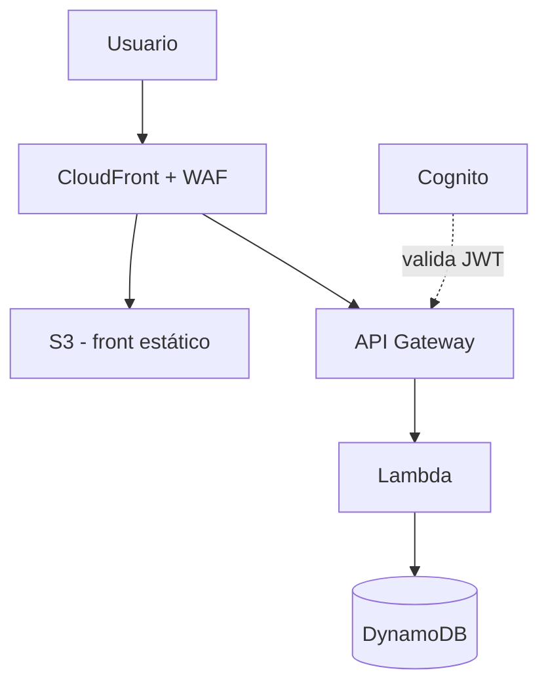
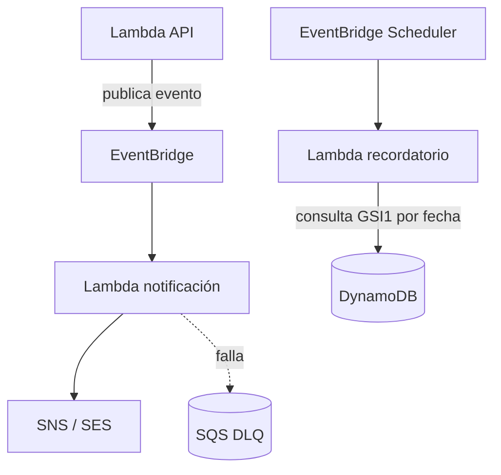

# Arquitectura — CookingLab

## 1. Introducción

**CookingLab** es una plataforma serverless en AWS para la gestión de
talleres de cocina y gastronomía. Permite a administradores (chefs e
instructores) publicar talleres, y a estudiantes explorarlos, inscribirse y
recibir notificaciones y recordatorios automáticos antes de cada sesión.

Este documento describe la arquitectura de referencia del sistema, las
decisiones técnicas tomadas y su justificación, y los mecanismos de
seguridad, observabilidad y gobernanza de costos aplicados.

## 2. Arquitectura de referencia (alto nivel)

El flujo de una petición típica es el siguiente:

1. El usuario llega a **CloudFront**, que tiene **WAF** delante filtrando
   tráfico malicioso (reglas rate-based y managed rules de SQLi/XSS).
2. CloudFront decide, según el path de la petición:
   - Si es una ruta de la SPA → sirve el **front estático desde S3** (bucket
     privado, accesible solo vía Origin Access Control).
   - Si la ruta empieza con `/api/*` → la reenvía a **API Gateway**.
3. Si la ruta requiere autenticación (crear, editar o borrar talleres),
   API Gateway aplica un **Cognito JWT Authorizer** que valida el token antes
   de invocar la Lambda correspondiente. Las rutas públicas (listar talleres,
   ver detalle) no pasan por el authorizer.
4. La **Lambda** invocada ejecuta la lógica de negocio y lee/escribe en
   **DynamoDB** (tabla única).

## 3. Arquitectura de eventos y notificaciones

Este flujo es **asíncrono** y desacoplado del anterior: una vez que la
Lambda de API termina de escribir en DynamoDB, no espera a que se envíen las
notificaciones — solo publica un evento y responde al usuario.

1. La Lambda de API publica eventos de dominio (`WORKSHOP_CREATED`,
   `STUDENT_REGISTERED`) en un bus de **EventBridge**.
2. Una regla de EventBridge invoca una **Lambda de notificación**, que
   publica el mensaje en **SNS/SES**. Si el envío falla, el evento cae en una
   **SQS DLQ** para reintentos.
3. Por separado, **EventBridge Scheduler** corre periódicamente (p. ej. cada
   hora), consulta DynamoDB vía **GSI1** (talleres ordenados por fecha de
   inicio) y dispara recordatorios a los inscritos de talleres que comienzan
   en las próximas 24 horas.

## 4. Decisiones de arquitectura

| Decisión | Justificación | Alternativas consideradas |
|---|---|---|
| **DynamoDB single-table design** | Acceso O(1) por PK/SK, sin joins; los access patterns (listar por fecha, filtrar por categoría) se resuelven con GSIs sin duplicar lógica de negocio. | Multi-tabla DynamoDB; base relacional (Aurora Serverless v2). |
| **API Gateway REST** (no HTTP API) | Soporta *Request Validator* nativo y *Usage Plans*/API Keys, requisitos explícitos del proyecto. | HTTP API (más barato pero sin validator nativo ni usage plans). |
| **Eventos desacoplados vía EventBridge** | Si falla el envío de una notificación, no afecta la respuesta al usuario ni bloquea la inscripción al taller. Facilita agregar nuevos consumidores sin tocar el handler original. | Publicar en SNS directamente desde el handler de registro. |
| **CloudFront con dos orígenes** (S3 + API Gateway) bajo un mismo dominio | Evita problemas de CORS entre front y API; un solo certificado ACM y un solo WAF cubren todo el tráfico. | Dominios separados para front y API. |
| **Cognito JWT Authorizer nativo de API Gateway** | Menos código repetido; API Gateway rechaza requests no autorizados antes de invocar Lambda, ahorrando invocaciones. | Validar el token JWT a mano dentro de cada Lambda. |

## 5. Seguridad

- **WAF** en CloudFront: reglas rate-based + managed rules de SQLi/XSS.
- **IAM least-privilege**: cada Lambda tiene una policy explícita, sin
  wildcards (`*`), limitada a las acciones y recursos que necesita.
- **Secrets Manager** para credenciales externas (no aplica si se usa SES,
  que no requiere credenciales SMTP separadas).
- **CORS** restringido al dominio de CloudFront (no `*` en producción).
- **S3**: bucket del front privado, acceso únicamente vía Origin Access
  Control (OAC) desde CloudFront.
- **API Gateway**: throttling por stage, *Request Validator* activo, access
  logs habilitados.

## 6. Observabilidad

- **CloudWatch Logs** por función, con retención de 30 días en `dev` y 90
  días en `prod`.
- **Alarms** sobre errores 5XX en la API, duración/errores/throttles en
  Lambda.
- **X-Ray** activado end-to-end (API Gateway + Lambda + SDK) para
  trazabilidad de requests.
- **Dashboard** con TPS, latencia P95, tasa de errores y consumo de
  lectura/escritura de DynamoDB.

## 7. Gobernanza de costos

- **Tagging** obligatorio en todos los recursos: `Project=CookingLab`,
  `Env=dev|prod`.
- **AWS Budgets** con alertas por correo ante umbrales de gasto.
- **DynamoDB en modo on-demand** para minimizar costo fijo en el entorno de
  desarrollo (sin necesidad de aprovisionar RCUs/WCUs).