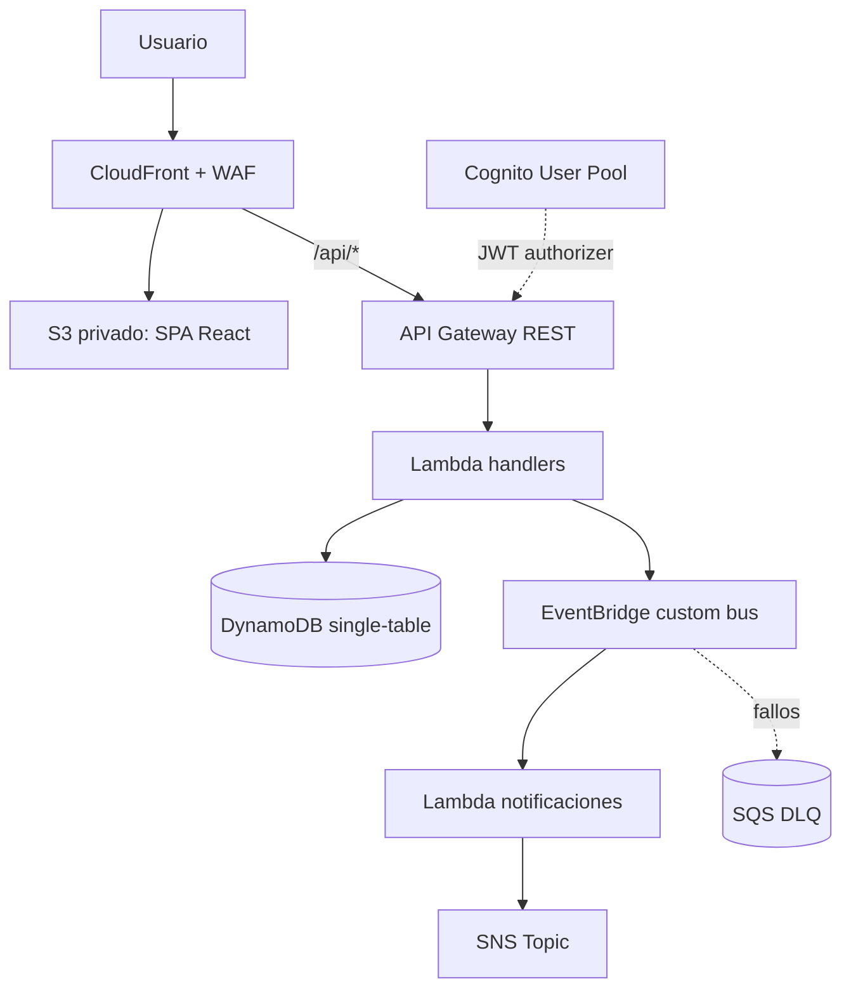

# Arquitectura - CookingLab

## Diagramas



```mermaid
flowchart TD
    CREATE[POST /workshops] -->|WORKSHOP_CREATED| EB[EventBridge]
    REGISTER[POST /workshops/{id}/register] -->|STUDENT_REGISTERED| EB
    EB --> OC[onWorkshopCreated Lambda]
    EB --> OS[onStudentRegistered Lambda]
    OC --> SNS[SNS Topic]
    OS --> SNS
    SCH[EventBridge schedule cada 1h] --> R[reminder Lambda]
    R --> DDB[(DynamoDB)]
    R --> SNS
```

## Decisiones

| Decision | Estado real | Justificacion |
| --- | --- | --- |
| AWS CDK v2 por stacks | Implementado | La infraestructura se divide en `DataStack`, `AuthStack`, `EventsStack`, `ApiStack`, `FrontStack`, `ObservabilityStack` y `CicdStack` para separar responsabilidades. |
| DynamoDB single-table | Implementado | `DataStack` crea una tabla con PK/SK, GSI1 para listados por fecha y GSI2 para filtros por categoria. |
| API Gateway REST | Implementado | Expone `/healthz`, `/workshops`, `/workshops/{id}` y `/workshops/{id}/register`; aplica throttling global de 50 rps/100 burst y throttling especifico de 10 rps/20 burst en inscripciones. |
| Lambdas Node.js 22 | Implementado | Los handlers HTTP y de eventos viven en `backend/src/handlers` y se empaquetan con `NodejsFunction`. |
| Cognito JWT Authorizer | Implementado | API Gateway valida JWT en rutas protegidas y los handlers admin verifican el grupo `admin` en `cognito:groups`. |
| EventBridge + SNS + DLQ | Implementado | Los eventos `WORKSHOP_CREATED` y `STUDENT_REGISTERED` desacoplan notificaciones del flujo HTTP; la DLQ captura fallos de reglas. |
| Frontend por CloudFront + S3 privado | Implementado | La SPA React se publica en S3 privado; CloudFront accede con Origin Access Control y sirve fallback a `index.html`. |
| WAF en CloudFront | Implementado | Usa regla rate-based y managed rule sets `AWSManagedRulesCommonRuleSet` y `AWSManagedRulesSQLiRuleSet`. |
| Observabilidad CloudWatch | Implementado | Incluye dashboard, alarmas API 5XX, errores/duracion/throttles Lambda y capacidad DynamoDB. |
| CI/CD con OIDC | Implementado | GitHub Actions asume un rol IAM mediante OIDC y usa el secret `AWS_DEPLOY_ROLE_ARN`; no se guardan access keys en GitHub. |
| Tests backend | Implementado | Vitest cubre handlers criticos de creacion e inscripcion y contract tests del schema de talleres. |
| CodeDeploy blue/green para Lambdas criticas | Evaluado, no implementado | Se evaluo blue/green deployment con CodeDeploy, pero la cuenta de AWS (free tier) restringe el acceso a este servicio para cuentas nuevas sin verificacion adicional - se documenta como decision consciente de alcance, no como una omision tecnica. |

## Seguridad

- WAF: `FrontStack` asocia un Web ACL a CloudFront con rate limit por IP, reglas comunes administradas por AWS y reglas SQLi.
- IAM: CDK usa grants para DynamoDB, EventBridge y SNS; el Custom Resource de CORS solo puede leer y actualizar configuracion de las Lambdas objetivo.
- IAM CI/CD: `CicdStack` usa OIDC de GitHub y `AdministratorAccess` como atajo academico; en produccion real deberia reducirse a permisos minimos de despliegue.
- Secrets Manager: el codigo actual no usa Secrets Manager porque no hay secretos runtime propios; Cognito usa `generateSecret: false` y GitHub guarda `AWS_DEPLOY_ROLE_ARN` como repository secret.
- CORS: los handlers responden con `ALLOWED_ORIGIN`; `FrontStack` actualiza esa variable con el dominio real de CloudFront mediante Custom Resource.
- S3: el bucket del frontend bloquea acceso publico y CloudFront accede mediante Origin Access Control.
- API Gateway: las rutas publicas no usan authorizer; las rutas de escritura usan Cognito JWT y throttling de stage/metodo.
