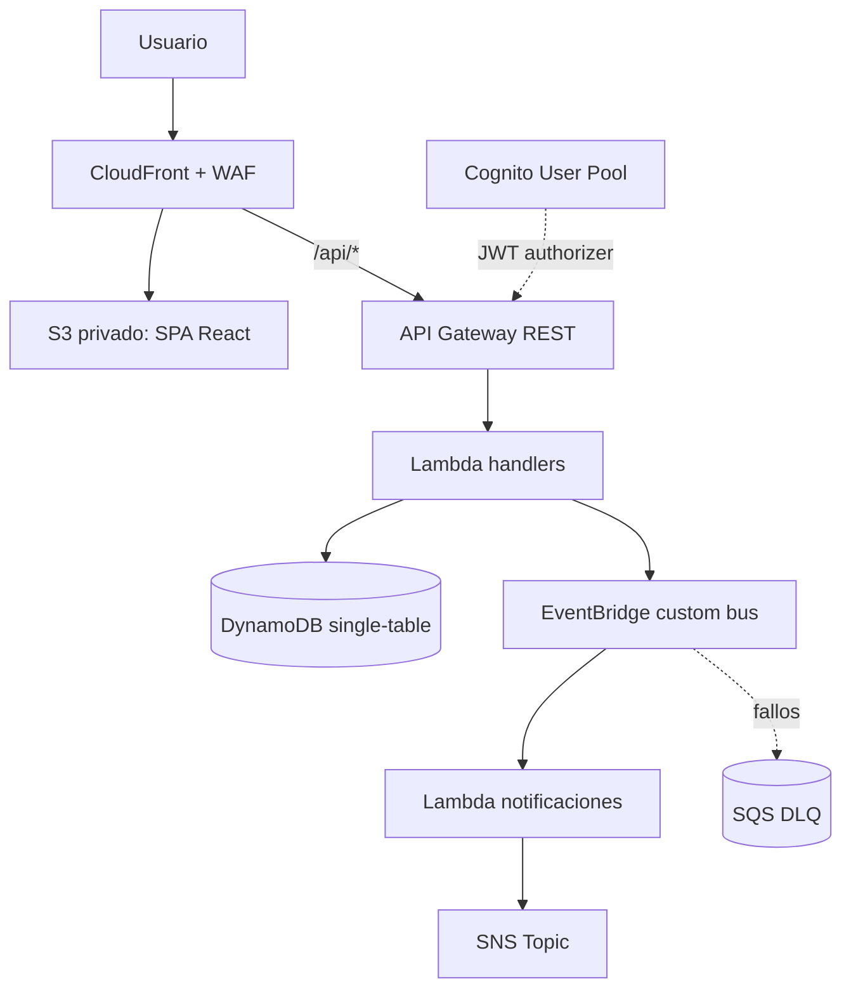

# Arquitectura - CookingLab

CookingLab es una aplicacion serverless para publicar talleres de cocina, permitir inscripciones y enviar notificaciones basadas en eventos. La infraestructura real esta definida con AWS CDK v2 en `infra/` y se divide en 7 stacks:

1. `DataStack`: tabla DynamoDB single-table con GSI1 y GSI2.
2. `AuthStack`: Cognito User Pool, User Pool Client y grupos `admin`/`student`.
3. `EventsStack`: EventBridge custom bus, reglas, Lambdas de notificacion, SNS Topic y SQS DLQ.
4. `ApiStack`: API Gateway REST, Cognito authorizer y Lambdas HTTP.
5. `FrontStack`: S3 privado, CloudFront, WAF, OAC y deploy de `frontend/dist`.
6. `ObservabilityStack`: dashboard y alarmas CloudWatch con acciones SNS.
7. `CicdStack`: rol IAM asumible por GitHub Actions mediante OIDC.

## Vista General



CloudFront sirve la SPA desde S3 y reenvia `/api/*` hacia API Gateway con el stage correspondiente. El bucket del frontend no es publico; CloudFront accede mediante Origin Access Control. El WAF de CloudFront incluye una regla rate-based y managed rule sets comunes y SQLi.

## Eventos

```mermaid
flowchart TD
    CREATE[POST /workshops] -->|WORKSHOP_CREATED| EB[EventBridge]
    REGISTER[POST /workshops/{id}/register] -->|STUDENT_REGISTERED| EB
    EB --> OC[onWorkshopCreated Lambda]
    EB --> OS[onStudentRegistered Lambda]
    OC --> SNS[SNS Topic]
    OS --> SNS
    SCH[EventBridge schedule cada 1h] --> R[reminder Lambda]
    R --> DDB[(DynamoDB)]
    R --> SNS
```

Los eventos de dominio reales son `WORKSHOP_CREATED` y `STUDENT_REGISTERED`, definidos en `shared/types.ts`. Las Lambdas de notificacion publican en SNS. La regla de recordatorios corre cada hora, consulta talleres por GSI1 y publica recordatorios para talleres que comienzan en menos de 24 horas.

## Decisiones

| Decision | Estado real | Justificacion |
| --- | --- | --- |
| DynamoDB single-table | Implementado en `DataStack` y `backend/src/lib/dynamo.ts` | Modela talleres e inscripciones con PK/SK y permite listados por fecha/categoria con GSI1/GSI2. |
| API Gateway REST | Implementado | Expone `/healthz`, `/workshops`, `/workshops/{id}` y `/workshops/{id}/register`; aplica throttling global de 50 rps/100 burst y throttling especifico de 10 rps/20 burst en inscripciones. |
| Cognito JWT Authorizer | Implementado para rutas protegidas | API Gateway valida JWT antes de Lambdas de escritura. Los permisos admin se verifican leyendo `cognito:groups`. |
| CodeDeploy blue/green para Lambdas criticas | Evaluado, no implementado | Se evaluo blue/green deployment con CodeDeploy, pero la cuenta de AWS (free tier) restringe el acceso a este servicio para cuentas nuevas sin verificacion adicional - se documenta como decision consciente de alcance, no como una omision tecnica. |
| EventBridge + SNS + DLQ | Implementado | Desacopla notificaciones del flujo HTTP y permite reintentos/DLQ. |
| Frontend por CloudFront + S3 privado | Implementado | Distribucion HTTPS, SPA fallback e invalidacion despues de `BucketDeployment`. |
| WAF en CloudFront | Implementado | Regla por tasa, AWSManagedRulesCommonRuleSet y AWSManagedRulesSQLiRuleSet. |
| Observabilidad CloudWatch | Implementado | Dashboard, alarmas API 5XX, errores/duracion/throttles Lambda y capacidad DynamoDB. |
| CI/CD con OIDC | Implementado | GitHub Actions asume un rol IAM sin guardar access keys en GitHub. |
| Tests backend | Implementado | Vitest cubre handlers criticos de creacion e inscripcion y contract tests del schema de talleres. |

## CI/CD

El pipeline real usa GitHub Actions:

- `ci.yml`: corre en PR hacia `dev` o `main`; instala dependencias, lint, build de backend/frontend/infra y `cdk synth`.
- `deploy-dev.yml`: corre en push a `dev`; asume el rol `AWS_DEPLOY_ROLE_ARN` via OIDC y despliega dev.
- `deploy-prod.yml`: corre con tags `v*` y usa el environment `production`.

No se almacenan Access Keys de AWS en GitHub. El unico secreto requerido para el pipeline es `AWS_DEPLOY_ROLE_ARN`, que apunta al output `GitHubActionsRoleArn` del `CicdStack`.

## Seguridad

- Cognito maneja registro, confirmacion, login y grupos `admin`/`student`.
- El frontend soporta el challenge `NEW_PASSWORD_REQUIRED` para usuarios creados manualmente en Cognito.
- Las Lambdas usan permisos grant de CDK sobre DynamoDB, EventBridge y SNS.
- CORS se configura inicialmente como `*` en el codigo Lambda, y `FrontStack` actualiza `ALLOWED_ORIGIN` en las Lambdas de API con el dominio real de CloudFront mediante un Custom Resource.
- `CicdStack` usa OIDC de GitHub y `AdministratorAccess` como atajo academico; para produccion real deberia reducirse a permisos minimos de despliegue.

## Gobernanza

El codigo actual usa nombres consistentes por stage (`cookinglab-<stage>-...`) y `RemovalPolicy.DESTROY` en dev para DynamoDB/S3/Cognito. No hay tagging automatico ni AWS Budget definidos en CDK; si existen budgets o tags de cuenta, fueron configurados fuera del repositorio y deben mantenerse como control operativo externo.
